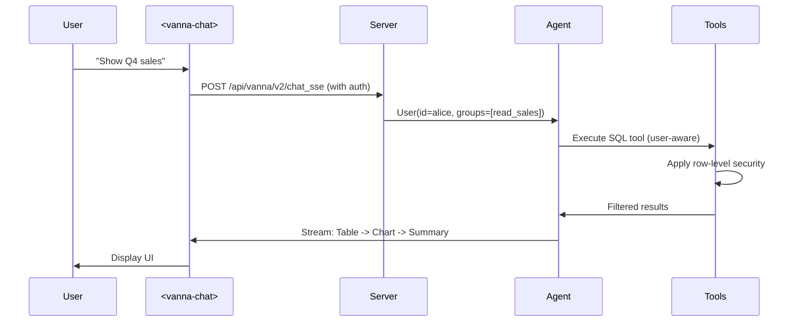

# Vanna Architecture

## System Overview

```
User Question -> Web Component -> Server -> Agent -> Tools -> Database
                      |              |
                   Cookies      User Resolver
                   /JWTs           |
                               LLM Service
```

## Core Components

### 1. Agent

The central orchestrator that:
- Receives user questions
- Routes to appropriate tools
- Manages conversation flow
- Streams responses

```python
from vanna import Agent, AgentConfig

agent = Agent(
    llm_service=llm,
    tool_registry=tools,
    user_resolver=user_resolver,
    config=AgentConfig(stream_responses=True)
)
```

### 2. UserResolver

Extracts user identity from requests:

```python
from vanna.core.user import UserResolver, User, RequestContext

class MyUserResolver(UserResolver):
    async def resolve_user(self, request_context: RequestContext) -> User:
        token = request_context.get_header('Authorization')
        user_data = self.decode_jwt(token)
        
        return User(
            id=user_data['id'],
            email=user_data['email'],
            group_memberships=user_data['groups'],
            metadata={'role': user_data['role']}
        )
```

### 3. ToolRegistry

Manages available tools:

```python
from vanna.core.registry import ToolRegistry
from vanna.tools import RunSqlTool

tools = ToolRegistry()
tools.register_local_tool(
    RunSqlTool(sql_runner=postgres_runner),
    access_groups=['user', 'admin']
)
```

### 4. LlmService

Handles LLM interactions:

```python
from vanna.integrations.anthropic import AnthropicLlmService

llm = AnthropicLlmService(
    model="claude-sonnet-4-5",
    api_key="sk-ant-..."
)
```

### 5. SqlRunner

Executes SQL against databases:

```python
from vanna.integrations.postgres import PostgresRunner

runner = PostgresRunner(
    host="localhost",
    dbname="mydb",
    user="user",
    password="password"
)
```

## Request Flow



## User-Aware Architecture

Every component knows the user identity:

1. **UserResolver** extracts identity from request
2. **Agent** passes User to all tools
3. **Tools** check permissions via `access_groups`
4. **SqlRunner** applies row-level security
5. **AuditLogger** tracks per-user activity

### Group-Based Access Control

```python
class MyTool(Tool):
    @property
    def access_groups(self) -> list[str]:
        return ["admin", "analyst"]  # Only these groups can use

# User with group_memberships=["user"] cannot access
# User with group_memberships=["admin"] can access
```

## Streaming Architecture

Responses stream via Server-Sent Events:

```python
# Server sends structured components
{
    "type": "progress",
    "data": {"message": "Generating SQL..."}
}
{
    "type": "code",
    "data": {"language": "sql", "content": "SELECT..."}
}
{
    "type": "table",
    "data": {"columns": [...], "rows": [...]}
}
{
    "type": "chart",
    "data": {"plotly_json": {...}}
}
{
    "type": "text",
    "data": {"content": "The top customers are..."}
}
```

## Configuration

### AgentConfig

```python
from vanna import AgentConfig

config = AgentConfig(
    stream_responses=True,
    max_iterations=10,
    temperature=0.7,
    pre_execution_hooks=[quota_hook],
    post_execution_hooks=[audit_hook]
)
```

### Server Configuration

```python
from vanna.servers.fastapi import VannaFastAPIServer

server = VannaFastAPIServer(
    agent,
    enable_cors=True,
    allowed_origins=["https://myapp.com"]
)
```

## Extension Points

1. **Custom Tools** - Extend `Tool` base class
2. **Lifecycle Hooks** - Pre/post execution hooks
3. **LLM Middlewares** - Caching, prompt engineering
4. **Context Enrichers** - RAG, memory, documentation
5. **Conversation Storage** - Persist history
6. **Audit Loggers** - Track activity
